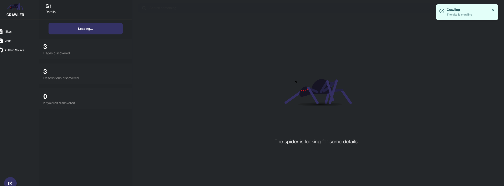
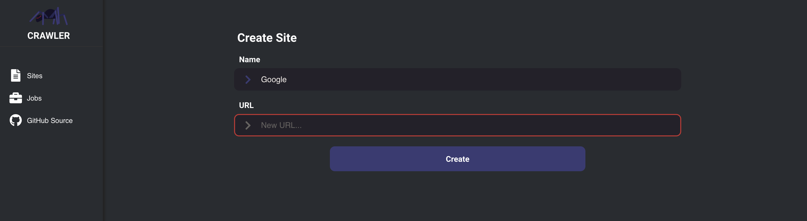
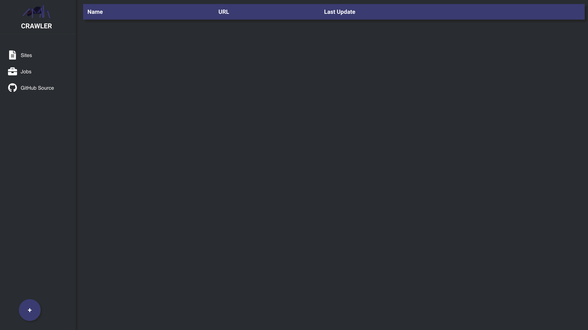

# Facto Brasil Crawler Project

This repository has two folders:

- **backend** - A folder for backend project made in NodeJS and Express.
- **frontend** - A folder for web project made in React.

## 🗾 Images

<h1 align="center">
  
  
  
<h1>
  
## 📋 Requirements

- **Yarn** or npm;
- **MongoDB** - Non Relational database.

## 🛑 Remember
- **Run your MongoDB server** or the project will not work.

## 🧾 How to run (step by step)

- **Clone this repository**;

```bash
# clone the repository
git clone https://github.com/henriqueantonio/factobrasil-crawler.git

```

- **Run the backend**:

```bash
  # enter the repository and use yarn tu run the dependencies
  cd factobrasil-crawler/backend && yarn
  
  # run the server
  yarn dev:server
```

- **Run the frontend**:

```bash
  # enter the repository and use yarn tu run the dependencies
  cd .. && cd frontend && yarn

  # run the application
  yarn start
```
